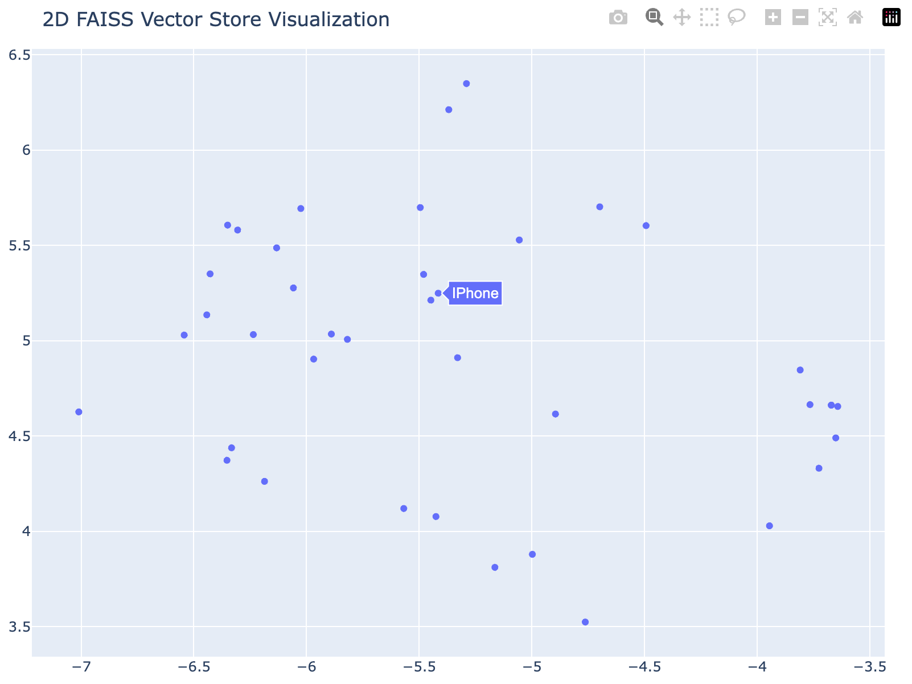
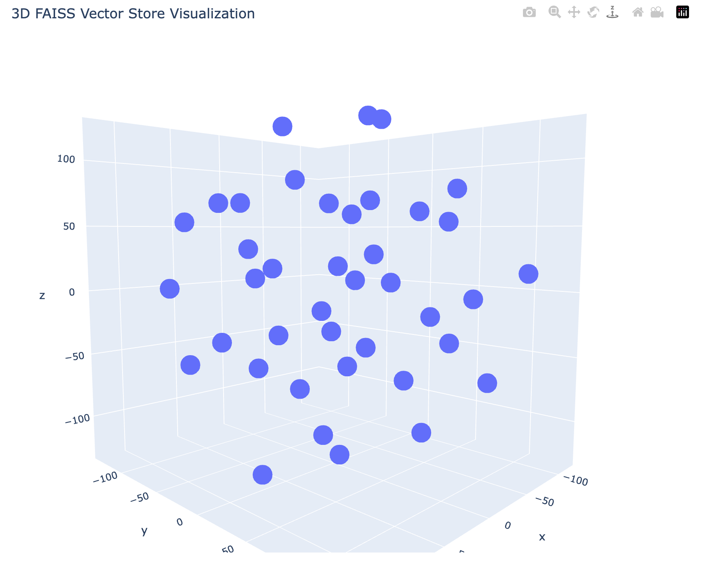

# visual_vector

By visualizing text embedding vectors, you can understand the similarity and distribution patterns between texts.

# Screenshot

# Project Structure

visual_simple_text

&nbsp;&nbsp;  | -- main_for_chroma.py

&nbsp;&nbsp;  | -- main_for_faiss.py

visual_notion

&nbsp;&nbsp;  | -- main_for_chroma.py

&nbsp;&nbsp; | -- main_for_faiss.py

# Visual Simple Text
Turn Simple Text to Embedding Vector and Visual in 2d or 3d way.

